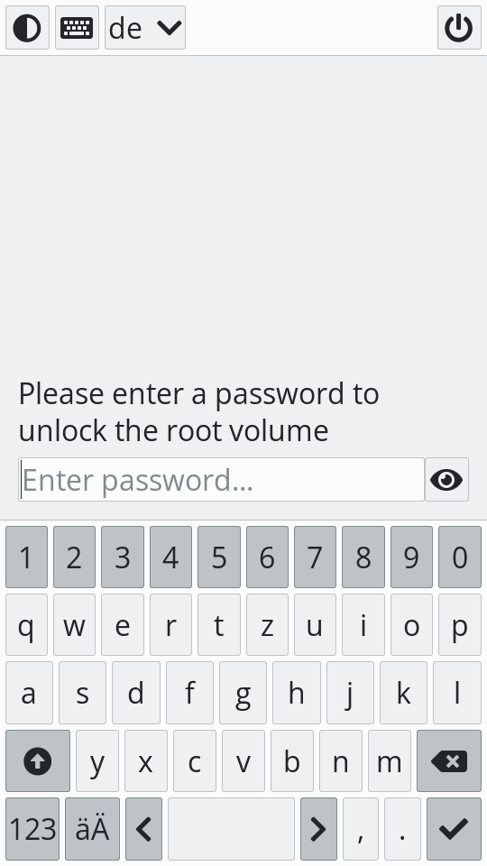
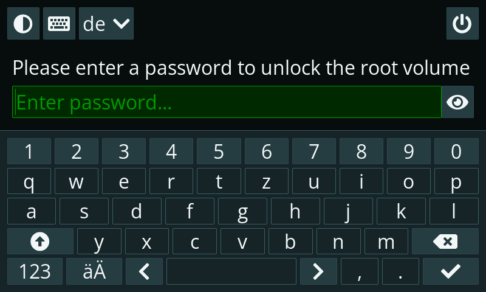

Unl0kr
======

Disk unlocker for the initramfs based on [LVGL].

[[_TOC_]]

# About

Unl0kr is an [osk-sdl] clone written in [LVGL] and rendering directly to the Linux framebuffer. As a result, it doesn't depend on GPU hardware acceleration.

For some background on how unl0kr came to be, see postmarketOS/osk-sdl#121.

# Status

While we continue to tweak and extend Unl0kr, it is deemed fully functional. Unl0kr has been set up as the default disk unlocker on [postmarketOS][package-pmos] and was also packaged for other distrubtions including [Arch Linux][package-arch] and [Debian][package-debian].

Here are a few highlights of the currently supported features:

- Password-entry UI including on-screen keyboard using either the Linux framebuffer or the DRM subsystem
- Automatic input device discovery (both at start-up and runtime) for keyboards, mice, trackpads and touch screens
- On-screen keyboard control via:
  - One or more mice / trackpads (including cursor)
  - One or more hardware keyboards (including support for different layouts using XKB)
  - Touchscreen
- Keyboard layout configuration (currently supported: de, es, fr, us) including switching the layout at runtime 
- Toggling on-screen keyboard with slide in/out animation
- Theming support including switching between light and dark theme at runtime
- Disclosing and hiding entered password at runtime
- Shutting down the device via a soft button

Screenshots of the currently available themes may be found in the [screenshots] folder.



<br>



# Usage

Unl0kr includes a man page. Additionally, you can get an overview of available command line options by running it with the `-h` or `--help` argument.

```
$ unl0kr --help
Usage: unl0kr [OPTION]

Unl0kr values the CRYPTTAB_TRIED variable. Upon completion, the entered
password is printed to STDOUT. All other output happens on STDERR.

Mandatory arguments to long options are mandatory for short options too.
  -C, --config-override     Path to a config override file. Can be supplied
                            multiple times. Config files are merged in the
                            following order:
                            * /usr/share/unl0kr/unl0kr.conf
                            * /usr/share/unl0kr/unl0kr.conf.d/* (alphabetically)
                            * /etc/unl0kr.conf
                            * /etc/unl0kr.conf.d/* (alphabetically)
                            * Override files (in supplied order)
  -g, --geometry=NxM[@X,Y]  Force a display size of N horizontal times M
                            vertical pixels, offset horizontally by X
                            pixels and vertically by Y pixels
  -d  --dpi=N               Override the display's DPI value
  -r, --rotate=[0-3]        Rotate the UI to the given orientation. The
                            values match the ones provided by the kernel in
                            /sys/class/graphics/fbcon/rotate.
                            * 0 - normal orientation (0 degree)
                            * 1 - clockwise orientation (90 degrees)
                            * 2 - upside down orientation (180 degrees)
                            * 3 - counterclockwise orientation (270 degrees)
  -h, --help                Print this message and exit
  -v, --verbose             Enable more detailed logging output on STDERR
  -V, --version             Print the unl0kr version and exit
```

For an example configuration file, see [unl0kr.conf].

# Development

## Dependencies

- [inih]
- [lvgl] (git submodule / linked statically)
- [squeek2lvgl] (linked statically)
- [libinput]
- [libudev]
- [libxkbcommon]
- [libdrm] (optional, required for the DRM backend)
- evdev kernel module
- [scdoc] (for generating the man page)

## Valgrind

> Using C without Valgrind is like skydiving without a parachute.

To be able to use Valgrind, add `default_options: ['optimization=g']` in the `project` section of `meson.build` and rebuild. Afterwards you can run the application with Valgrind's leaks check enabled via

```
sudo valgrind --leak-check=yes ../_build/unl0kr/unl0kr
```

## Backends

Unl0kr supports multiple LVGL display drivers, referred to as "backends".

- fbdev
- drm (optional)

The active backend can be selected via the `general.backend` option in the configuration file.

Note that if [libdrm] is installed, the DRM backend will be compiled in automatically. It's possible to prevent this behaviour by passing the `with-drm` option to meson.

```
$ meson _build -Dwith-drm=disabled
```

## Keyboard layouts

Unl0kr uses [squeekboard layouts] converted to C via [squeek2lvgl]. To regenerate the layouts, ensure that you have pipenv installed (e.g. via `pip install --user pipenv`) and then run

```
$ ./regenerate-layouts.sh
```

## Generating screenshots

To generate screenshots in a variety of common sizes, install [fbcat], build unl0kr and then run

```
$ sudo ./regenerate-screenshots ../_build/unl0kr/unl0kr
```

where `../_build/unl0kr/unl0kr` is the location of the unl0kr binary.

## Screen recording

For demonstration purposes you can record the framebuffer device, e.g. with ffmpeg:

```
$ sudo ffmpeg -f fbdev -i /dev/fb0 -r 24 -c:v libx264 -b:v 500k demo.avi
```

# Acknowledgements

The [lv_port_linux_frame_buffer] project served as a starting point for the codebase.

[LVGL]: https://lvgl.io
[adjust]: https://fontawesome.com/v5.15/icons/adjust?style=solid
[arrow-alt-circle-up]: https://fontawesome.com/v5.15/icons/arrow-alt-circle-up?style=solid
[fbcat]: https://github.com/jwilk/fbcat
[inih]: https://github.com/benhoyt/inih
[libinput]: https://gitlab.freedesktop.org/libinput/libinput
[libudev]: https://github.com/systemd/systemd/tree/main/src/libudev
[libxkbcommon]: https://github.com/xkbcommon/libxkbcommon
[libdrm]: https://gitlab.freedesktop.org/mesa/drm
[lv_port_linux_frame_buffer]: https://github.com/lvgl/lv_port_linux_frame_buffer
[lvgl]: https://github.com/lvgl/lvgl
[online font converter]: https://lvgl.io/tools/fontconverter
[osk-sdl]: https://gitlab.com/postmarketOS/osk-sdl
[package-arch]: https://aur.archlinux.org/packages/unl0kr
[package-debian]: https://tracker.debian.org/pkg/unl0kr
[package-pmos]: https://gitlab.com/postmarketOS/pmaports/-/tree/master/main/unl0kr
[scdoc]: https://git.sr.ht/~sircmpwn/scdoc
[screenshots]: ./screenshots
[squeek2lvgl]: ../squeek2lvgl
[squeekboard layouts]: https://gitlab.gnome.org/World/Phosh/squeekboard/-/tree/master/data/keyboards
[unl0kr.conf]: ./unl0kr.conf
